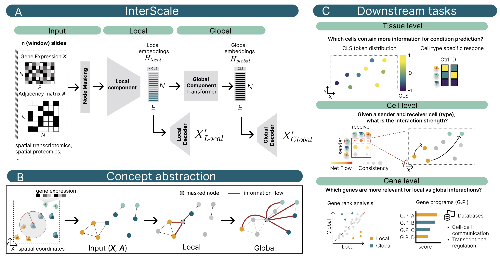

# InterScale

InterScale is a package for multi-scale analysis of cellular interactions in spatial transcriptomics data. It is built on top of [geome](https://github.com/theislab/geome) (single-cell building on top of [PyG](https://pytorch-geometric.readthedocs.io/en/latest/)), [AnnData](https://anndata.readthedocs.io/en/latest/) and [scvi-tools](https://scvi-tools.org/).



::::{grid} 1 2 3 3
:gutter: 2

:::{grid-item-card} Installation {octicon}`plug;1em;`
:link: installation
:link-type: doc

Check out the installation guide.
:::

:::{grid-item-card} Tutorials {octicon}`play;1em;`
:link: notebooks/index
:link-type: doc

Learn by following example application of InterScale.
:::

:::{grid-item-card} API {octicon}`info;1em;`
:link: api/index
:link-type: doc

Find a detailed description of InterScales APIs.
:::

:::{grid-item-card} Release Notes {octicon}`tag;1em;`
:link: changelog
:link-type: doc

Follow the latest changes to InterScale.
:::

:::{grid-item-card} Contributing {octicon}`code;1em;`
:link: contributing
:link-type: doc

Help improve InterScale.
:::

:::{grid-item-card} References {octicon}`code;1em;`
:link: references
:link-type: doc

References to supporting packages and publications used in InterScale.
:::

::::

If you find InterScale useful for your research, please consider citing the InterScale preprint.

```{toctree}
:hidden:
:maxdepth: 1

installation
api/index
notebooks/index
changelog
contributing
references
```
